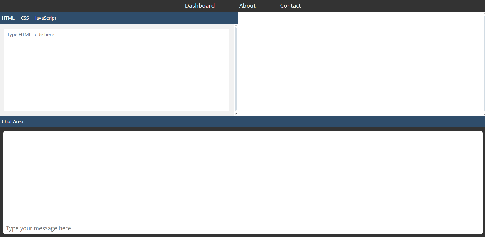

# Codependal-V2

Codependal editor version v2

## About

Codependal editor version v2

[Live Demo](https://abhay557.github.io/Codependal-V2/)

## Features

- **Real-time Preview:** Instantly see the results of your HTML, CSS, and JavaScript code.
- **Web-Based Editor:** No installation required; access the editor directly from your browser.
- **User-Friendly Interface:** Simple and intuitive design for seamless coding experience.

## Preview



- **Navigation Bar**: Links to the **Dashboard, About, and Contact** pages.
- **Code Editor Tabs**: Sections for **HTML, CSS, and JavaScript**, where users can write and edit their code.
- **Live Preview Window**: Displays the real-time output of the code written in the editor.
- **Chat Area**: A dedicated section where users can type messages or receive assistance.

## Getting Started

To use Codependal-V2:

1. Clone the repository:

   ```bash
   git clone https://github.com/abhay557/Codependal-V2.git
   ```

2. Navigate to the project directory:

   ```bash
   cd Codependal-V2
   ```

3. Open `index.html` in your preferred web browser to start coding.

## License

This project is licensed under the MIT License. See the [LICENSE](LICENSE) file for details.

